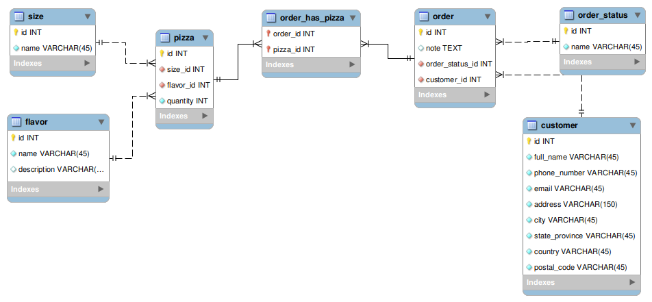

# Pizzeria API 
*by Tiago*

## Github Clone
```bash
$ git clone https://github.com/tiagomellobr/pizzeria.git
$ cd pizzeria/
```

## Run Local Environment
- set up a local database
- change the connection in settings.py
- run the commands below
- access [localhost:8000](http://localhost:8000)
```bash
$ pip install -r requirements.txt
$ python manage.py migrate
$ python manage.py loaddata fixtures.json 
$ python manage.py runserver
$ python manage.py test
```

## Run Docker
- run the commands below
- access [localhost:8000](http://localhost:8000)
```bash
$ docker-compose up -d
$ docker-compose exec web python manage.py migrate
$ docker-compose exec web python manage.py loaddata fixtures.json
$ docker-compose exec web python manage.py test
```

### EER Diagram
